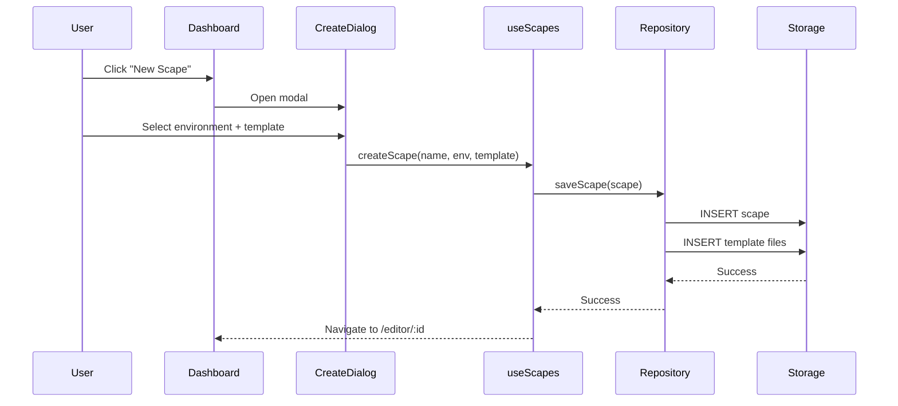
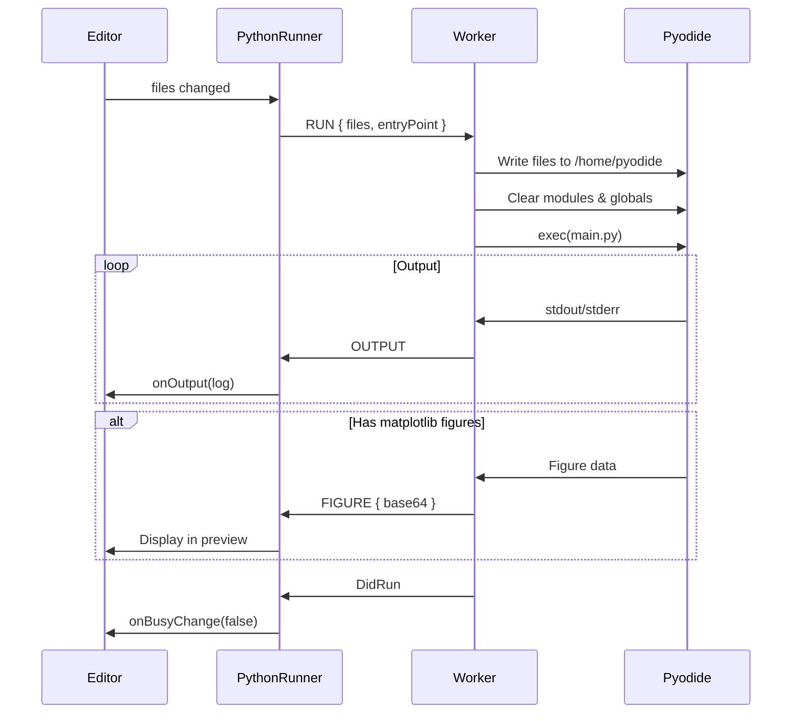

# CodeScapes

> **A Multi-Runtime, Browser-Native IDE for Code Education and Creative Development**

CodeScapes is an open-source, browser-based integrated development environment (IDE) designed to provide instant, zero-installation coding experiences across multiple programming languages and paradigms. Built with modern web technologies, it demonstrates advanced techniques in browser-based code execution, cross-origin isolation, and real-time collaborative architecture.

---

## ⚠️ License & Usage Restrictions

**This software is licensed for NON-COMMERCIAL use only.**

You may:

- Use this software for personal, educational, or research purposes
- Modify and fork the code for non-commercial projects
- Reference this architecture in academic papers (with attribution)

You may NOT:

- Use this software or derivatives in commercial products
- Sell or monetize applications built with this codebase
- Deploy this software as a paid service

For commercial licensing inquiries, please contact:

- 📧 **contact@aaqidmasoodi.com**
- 📧 **collaborate@codescapes.io**

---

## 🤝 Collaboration & Contact

We welcome contributions from the open-source community! Whether you're interested in:

- Adding new runtime environments
- Improving the execution sandbox
- Enhancing the block-based FlowScape editor
- Documentation and research papers

**Get in touch:**

- 📧 **contact@aaqidmasoodi.com**
- 📧 **collaborate@codescapes.io**

---

## Table of Contents

1. [Architecture Overview](#architecture-overview)
2. [Technology Stack](#technology-stack)
3. [Core Subsystems](#core-subsystems)
   - [Runtime Execution Layer](#1-runtime-execution-layer)
   - [Storage Abstraction Layer](#2-storage-abstraction-layer)
   - [Preview Isolation System](#3-preview-isolation-system)
   - [State Management](#4-state-management)
   - [File System Management](#5-file-system-management)
4. [Runtime Implementations](#runtime-implementations)
   - [Python Runtime](#python-runtime-pyodide)
   - [Web Runtime](#web-runtime-html-css-js)
   - [FlowScape Runtime](#flowscape-runtime-visual-programming)
5. [Security Architecture](#security-architecture)
6. [Data Flow Diagrams](#data-flow-diagrams)
7. [Development Setup](#development-setup)
8. [Contributing](#contributing)

---

## Architecture Overview

CodeScapes implements a **layered architecture** designed for extensibility, security, and performance:

```
┌─────────────────────────────────────────────────────────────────────┐
│                         Presentation Layer                          │
│  ┌─────────────┐  ┌──────────────┐  ┌─────────────┐  ┌───────────┐ │
│  │  Dashboard  │  │ ScapeEditor  │  │ FlowEditor  │  │  Header   │ │
│  └─────────────┘  └──────────────┘  └─────────────┘  └───────────┘ │
└─────────────────────────────────────────────────────────────────────┘
                                │
                                ▼
┌─────────────────────────────────────────────────────────────────────┐
│                        Runtime Execution Layer                       │
│  ┌─────────────────┐  ┌─────────────────┐  ┌─────────────────────┐  │
│  │  PythonRunner   │  │   WebRunner     │  │    FlowRunner       │  │
│  │  (Web Worker)   │  │  (iframe + SW)  │  │  (p5.js Engine)     │  │
│  └─────────────────┘  └─────────────────┘  └─────────────────────┘  │
└─────────────────────────────────────────────────────────────────────┘
                                │
                                ▼
┌─────────────────────────────────────────────────────────────────────┐
│                       State Management Layer                         │
│  ┌──────────────────────┐  ┌────────────────────────────────────┐   │
│  │  Zustand Stores      │  │  React Hooks                       │   │
│  │  - flowStore         │  │  - useFileSystem                   │   │
│  │  - (app state)       │  │  - usePreviewBridge                │   │
│  └──────────────────────┘  │  - useScapes, useAuth              │   │
│                            └────────────────────────────────────┘   │
└─────────────────────────────────────────────────────────────────────┘
                                │
                                ▼
┌─────────────────────────────────────────────────────────────────────┐
│                     Storage Abstraction Layer                        │
│  ┌─────────────────────────────────────────────────────────────┐    │
│  │               IScapeRepository Interface                     │    │
│  │  ┌─────────────────────┐    ┌─────────────────────────────┐ │    │
│  │  │  LocalRepository    │    │     CloudRepository         │ │    │
│  │  │  (IndexedDB/Dexie)  │    │     (Supabase)              │ │    │
│  │  └─────────────────────┘    └─────────────────────────────┘ │    │
│  └─────────────────────────────────────────────────────────────┘    │
└─────────────────────────────────────────────────────────────────────┘
```

---

## Technology Stack

| Layer                  | Technology              | Purpose                                       |
| ---------------------- | ----------------------- | --------------------------------------------- |
| **Frontend Framework** | React 18 + TypeScript   | Component architecture & type safety          |
| **Build Tool**         | Vite 7                  | Fast HMR, ESBuild bundling                    |
| **Styling**            | TailwindCSS + shadcn/ui | Utility-first styling, accessible components  |
| **State Management**   | Zustand                 | Lightweight, immutable state stores           |
| **Local Storage**      | Dexie.js (IndexedDB)    | Client-side persistence with live queries     |
| **Cloud Backend**      | Supabase                | Authentication, PostgreSQL, Realtime, Storage |
| **Code Editor**        | Monaco Editor           | VS Code-grade editing experience              |
| **Block Editor**       | Blockly                 | Visual block-based programming                |
| **Python Runtime**     | Pyodide 0.25            | WebAssembly Python interpreter                |
| **Graphics Engine**    | p5.js                   | FlowScape visual runtime                      |
| **Testing**            | Vitest + Playwright     | Unit tests + E2E browser tests                |

---

## Core Subsystems

### 1. Runtime Execution Layer

The runtime layer is architected around a **polymorphic runner interface** that enables multiple language runtimes to coexist:

```typescript
// src/runners/types.ts
interface ScapeRunnerProps {
  files: ScapeFile[]
  dependencies?: string[]
  onOutput?: (log: LogEntry) => void
  onBusyChange?: (isBusy: boolean) => void
  onInputRequest?: (prompt: string) => void
  isLive?: boolean
}

interface ScapeRunnerHandle {
  captureThumbnail(): Promise<string | null>
  restart(): Promise<void>
  installPackage(
    pkg: string,
    onProgress?: (msg: string) => void
  ): Promise<{ success: boolean; error?: string }>
  stop?: () => void
}
```

A **Runner Registry** (`src/runners/registry.ts`) maps environment types to their corresponding runner components:

```typescript
const RUNNER_REGISTRY = {
  web: WebRunner,
  python: PythonRunner,
  "data-science": PythonRunner,
  flowscape: FlowRunner,
  node: WebRunner, // Fallback
}
```

---

### 2. Storage Abstraction Layer

CodeScapes implements the **Repository Pattern** to abstract storage operations, allowing seamless switching between local (IndexedDB) and cloud (Supabase) backends:

```typescript
// src/lib/repositories/types.ts
interface IScapeRepository {
  // Scape (Project) Operations
  getScape(id: string): Promise<Scape | undefined>
  listScapes(userId?: string): Promise<Scape[]>
  saveScape(scape: Scape): Promise<void>
  updateScape(id: string, updates: Partial<Scape>): Promise<void>
  deleteScape(id: string): Promise<void>

  // File Operations
  getFiles(scapeId: string): Promise<ScapeFile[]>
  createFile(file: ScapeFile & { scapeId: string }): Promise<void>
  bulkCreateFiles(files: (ScapeFile & { scapeId: string })[]): Promise<void>
  updateFileContent(id: string, content: string | Blob | ArrayBuffer | Uint8Array): Promise<void>
  updateFileName(id: string, name: string): Promise<void>
  deleteFile(id: string): Promise<void>

  // Bulk Operations
  bulkDeleteFiles(ids: string[]): Promise<void>
  bulkUpdateFiles(updates: { id: string; changes: Partial<ScapeFile> }[]): Promise<void>

  // Realtime Subscriptions (Cloud only)
  subscribeToFiles?(scapeId: string, callback: (event, payload) => void): () => void
}
```

**Implementations:**

| Repository        | Backend              | Features                                                       |
| ----------------- | -------------------- | -------------------------------------------------------------- |
| `LocalRepository` | Dexie.js (IndexedDB) | Offline-first, instant persistence, live queries               |
| `CloudRepository` | Supabase             | User authentication, cross-device sync, realtime collaboration |

The **local database schema** (`src/lib/db.ts`):

```typescript
interface Scape {
  id: string
  name: string
  environment: EnvironmentId // "web" | "python" | "flowscape"
  template: string
  source: "local" | "cloud"
  syncStatus?: "synced" | "dirty" | "offline"
  authorId?: string
  thumbnail?: string
  createdAt: Date
  updatedAt: Date
  dependencies?: string[]
  is_public?: boolean
}

interface File {
  id: string
  scapeId: string
  name: string
  content: string | Blob | ArrayBuffer | Uint8Array
  language: string
}

interface Autosave {
  id: string // scapeId
  data: any // Project JSON (for FlowScape)
  timestamp: number
}
```

---

### 3. Preview Isolation System

A critical security and functionality challenge in browser-based IDEs is **isolating user code execution** from the host application. CodeScapes implements a sophisticated **Cross-Origin Bootloader Architecture**:

```
┌──────────────────────────────────────────────────────────────────┐
│                        Main Application                           │
│  ┌─────────────────────────────────────────────────────────────┐ │
│  │  usePreviewBridge Hook                                       │ │
│  │  - Computes file hash for change detection                  │ │
│  │  - Manages handshake protocol with sandbox                  │ │
│  │  - Hot-swap files via postMessage                           │ │
│  └─────────────────────────────────────────────────────────────┘ │
└──────────────────────────────────────────────────────────────────┘
                            │ postMessage
                            ▼
┌──────────────────────────────────────────────────────────────────┐
│                      Sandbox iframe                               │
│  Origin: localhost:3002 (dev) or /sandbox/* (prod)               │
│  ┌─────────────────────────────────────────────────────────────┐ │
│  │  bootloader.html                                             │ │
│  │  - Receives COMPILE_FILES message                           │ │
│  │  - Injects user HTML/CSS/JS into document                   │ │
│  │  - Executes in isolated context                             │ │
│  └─────────────────────────────────────────────────────────────┘ │
└──────────────────────────────────────────────────────────────────┘
```

**Handshake Protocol:**

1. Parent creates iframe pointing to bootloader URL with cache-busting version key
2. Bootloader sends `SANDBOX_READY` message to parent
3. Parent responds with `COMPILE_FILES` containing all user files
4. Bootloader injects files and executes user code
5. For hot updates: parent detects file hash changes and re-sends `COMPILE_FILES`

**Key Security Properties:**

- User code runs in a separate origin (process isolation on Chrome)
- CSP and sandbox attributes restrict capabilities
- No direct DOM access between parent and child

---

### 4. State Management

CodeScapes uses **Zustand** for global state management, particularly for the FlowScape visual editor:

```typescript
// src/stores/flowStore.ts
interface FlowState {
  project: Project // Full project state (sprites, blocks, costumes)
  activeTargetId: string // Currently selected sprite/stage
  isHydrated: boolean // Whether state is loaded from storage

  // Actions
  hydrate: (scapeId: string, initialProject?: Project) => Promise<void>
  setActiveTarget: (id: string) => void
  addSprite: (asset?: { name: string; color?: string }) => void
  addBackdrop: (asset: { name: string; color: string }) => void
  deleteTarget: (targetId: string) => void
  updateTargetBlocks: (targetId: string, blocks: any) => void
  updateTargetCode: (targetId: string, code: string) => void
  syncTargets: (updates: Partial<Target>[]) => void
}
```

**Persistence Strategy:**

The store implements **automatic autosave** via Zustand subscriptions:

```typescript
export const initAutosave = (scapeId: string) => {
  return useFlowStore.subscribe((state) => {
    if (!state.isHydrated) return // Don't overwrite real data with empty state

    db.autosaves.put({
      id: scapeId,
      data: state.project,
      timestamp: Date.now(),
    })
  })
}
```

This ensures that every state change is immediately persisted to IndexedDB, providing crash recovery and session restoration.

---

### 5. File System Management

The `useFileSystem` hook (`src/hooks/useFileSystem.ts`) provides a unified interface for file operations across local and cloud storage:

```typescript
function useFileSystem(scapeId: string, source: "local" | "cloud" = "local") {
  // Returns:
  return {
    files: ScapeFile[],           // Current file list
    isInitialized: boolean,       // Whether files are loaded

    // CRUD Operations
    createFile: (name, language, content) => Promise<void>,
    updateFile: (name, content) => Promise<void>,
    renameFile: (oldName, newName) => Promise<void>,
    deleteFile: (name) => Promise<void>,
    moveFile: (oldPath, newPath) => Promise<void>,

    // Bulk Operations
    createFolder: (path) => Promise<void>,
    deleteFolder: (path) => Promise<void>,
    moveFolder: (oldPath, newPath) => Promise<void>,
  }
}
```

**Key Features:**

- **Optimistic Updates**: UI updates immediately while async operations complete
- **Live Queries** (Local): Dexie's `useLiveQuery` for reactive data binding
- **Realtime Subscriptions** (Cloud): Supabase Realtime for collaborative editing
- **Smart Merge**: When files change externally, intelligent conflict resolution

---

## Runtime Implementations

### Python Runtime (Pyodide)

The Python runtime (`src/runners/python/`) uses **Pyodide** (Python compiled to WebAssembly) running in a dedicated **Web Worker** for isolation:

```
┌────────────────────────────────────────────────────────────────┐
│                    Main Thread (React)                          │
│  ┌─────────────────────────────────────────────────────────┐   │
│  │  PythonRunner.tsx                                        │   │
│  │  - Manages worker lifecycle                              │   │
│  │  - Sends RUN/INSTALL messages                            │   │
│  │  - Receives OUTPUT/ERROR/FIGURE responses                │   │
│  └─────────────────────────────────────────────────────────┘   │
└────────────────────────────────────────────────────────────────┘
                         │ postMessage
                         ▼
┌────────────────────────────────────────────────────────────────┐
│                    Web Worker Thread                            │
│  ┌─────────────────────────────────────────────────────────┐   │
│  │  worker.ts                                               │   │
│  │  ┌─────────────────────────────────────────────────┐    │   │
│  │  │  Pyodide (WASM)                                  │    │   │
│  │  │  - Python interpreter                            │    │   │
│  │  │  - Virtual file system (/home/pyodide)          │    │   │
│  │  │  - micropip for package installation            │    │   │
│  │  └─────────────────────────────────────────────────┘    │   │
│  │                                                          │   │
│  │  Features:                                               │   │
│  │  - stdout/stderr capture and streaming                  │   │
│  │  - matplotlib figure capture (base64 PNG)              │   │
│  │  - Python input() support via Service Worker           │   │
│  │  - Module hot-reload with sys.modules cleanup          │   │
│  └─────────────────────────────────────────────────────────┘   │
└────────────────────────────────────────────────────────────────┘
```

**Message Protocol:**

| Message Type    | Direction     | Purpose                                  |
| --------------- | ------------- | ---------------------------------------- |
| `INIT`          | Main → Worker | Initialize Pyodide, install dependencies |
| `RUN`           | Main → Worker | Execute Python code with file system     |
| `INSTALL`       | Main → Worker | Install packages via micropip            |
| `OUTPUT`        | Worker → Main | stdout/stderr text                       |
| `ERROR`         | Worker → Main | Python exception details                 |
| `FIGURE`        | Worker → Main | Base64 matplotlib figure                 |
| `INPUT_REQUEST` | Worker → Main | Python `input()` prompt                  |
| `FS_UPDATE`     | Worker → Main | File system changes from Python          |

**Hot-Reload Implementation:**

On each `RUN` message, the worker performs aggressive module cleanup:

```python
# 0. Reset Environment
for name in list(globals().keys()):
    if name not in ['__name__', '__doc__', '__package__', ...]:
        del globals()[name]

# 0.1 Aggressive Module Cleanup
import sys
to_delete = []
for name, module in list(sys.modules.items()):
    if hasattr(module, '__file__') and module.__file__:
        if not module.__file__.startswith('/lib'):
            to_delete.append(name)

for name in to_delete:
    del sys.modules[name]

importlib.invalidate_caches()
```

This ensures that user-defined modules are reloaded from disk on each run, providing true hot-reload semantics.

---

### Web Runtime (HTML/CSS/JS)

The Web runtime (`src/runners/web/WebRunner.tsx`) uses the **Cross-Origin Bootloader** system described in the [Preview Isolation System](#3-preview-isolation-system) section.

**Key Characteristics:**

- **Full Reload on Change**: Unlike traditional HMR, CodeScapes forces full iframe reloads for reliability
- **Import Map Support**: ES Modules with import maps (e.g., Three.js, p5.js)
- **Secret Injection**: Environment variables are injected via the bootloader protocol
- **Thumbnail Capture**: Uses html2canvas for project thumbnails

---

### FlowScape Runtime (Visual Programming)

FlowScape (`src/runners/flow/`) is a **Scratch-inspired visual programming environment** built with:

- **Blockly**: Google's visual block programming library
- **p5.js**: The graphics engine for real-time rendering
- **Custom Compiler**: Converts blocks to executable JavaScript

```
┌────────────────────────────────────────────────────────────────┐
│                    FlowEditor.tsx                               │
│  ┌─────────────────────────────────────────────────────────┐   │
│  │  BlockEditor (Blockly)                                   │   │
│  │  - Sprite selection panel                                │   │
│  │  - Block palette & workspace                             │   │
│  │  - Real-time code generation                             │   │
│  └─────────────────────────────────────────────────────────┘   │
│                         │ Block Changes                         │
│                         ▼                                       │
│  ┌─────────────────────────────────────────────────────────┐   │
│  │  FlowRunner.tsx                                          │   │
│  │  - Compiles project.json to engine bundle               │   │
│  │  - Injects p5.js + custom engine.js                     │   │
│  │  - Bi-directional state sync via postMessage            │   │
│  └─────────────────────────────────────────────────────────┘   │
│                         │                                       │
│                         ▼                                       │
│  ┌─────────────────────────────────────────────────────────┐   │
│  │  iframe (p5.js Runtime)                                  │   │
│  │  ┌─────────────────────────────────────────────────┐    │   │
│  │  │  Runtime Class                                   │    │   │
│  │  │  - Manages Target (Sprite) instances             │    │   │
│  │  │  - Scheduler for concurrent script execution     │    │   │
│  │  │  - Collision detection, movement, costumes       │    │   │
│  │  └─────────────────────────────────────────────────┘    │   │
│  │  ┌─────────────────────────────────────────────────┐    │   │
│  │  │  Target Class                                    │    │   │
│  │  │  - Position, direction, size, visibility        │    │   │
│  │  │  - Costume management                            │    │   │
│  │  │  - User code (from blocks)                       │    │   │
│  │  └─────────────────────────────────────────────────┘    │   │
│  │  ┌─────────────────────────────────────────────────┐    │   │
│  │  │  Scheduler Class                                 │    │   │
│  │  │  - Cooperative multitasking via generators       │    │   │
│  │  │  - waitSeconds() via yield                       │    │   │
│  │  │  - Thread management per target                  │    │   │
│  │  └─────────────────────────────────────────────────┘    │   │
│  └─────────────────────────────────────────────────────────┘   │
└────────────────────────────────────────────────────────────────┘
```

**State Synchronization:**

FlowScape maintains bi-directional sync between the Zustand store and the iframe runtime:

1. **Store → Runtime**: When blocks change, the compiler generates new code and sends it via `FLOW:HOT_UPDATE`
2. **Runtime → Store**: The runtime broadcasts sprite positions every ~100ms via `FlowScape:StateUpdate`

This enables:

- Live editing of block code with instant preview
- Dragging sprites in the preview updates the editor state
- Runtime state preservation during code hot-swaps

---

## Security Architecture

### Threat Model

CodeScapes executes **arbitrary user code** in the browser. The security model addresses:

1. **DOM Isolation**: User code cannot access parent application DOM
2. **Origin Isolation**: Sandboxed iframes run on separate origins (process isolation)
3. **Network Restrictions**: CSP limits outbound network requests
4. **Storage Isolation**: User projects cannot access other users' data

### Implementation

| Mechanism                     | Purpose                             |
| ----------------------------- | ----------------------------------- |
| Cross-Origin iframes          | Process-level isolation on Chromium |
| `sandbox` attribute           | Restricts iframe capabilities       |
| Service Worker interception   | Controls resource loading           |
| Row-Level Security (Supabase) | Database access control             |
| Web Worker isolation          | Python runs in isolated thread      |

---

## Data Flow Diagrams

### Project Creation Flow



### Python Execution Flow



---

## Development Setup

### Prerequisites

- Node.js 18+
- pnpm (recommended) or npm

### Installation

```bash
# Clone the repository
git clone https://github.com/aaqidmasoodi/CodeScapes.git
cd CodeScapes

# Install dependencies
pnpm install

# Start development server
pnpm dev
```

### Environment Variables

Create a `.env.local` file:

```env
VITE_SUPABASE_URL=your_supabase_url
VITE_SUPABASE_ANON_KEY=your_supabase_anon_key
```

### Running Tests

```bash
# Unit tests
pnpm test

# E2E tests
pnpm test:e2e

# Type checking
pnpm typecheck
```

---

## Contributing

We welcome contributions! Please see our [CONTRIBUTING.md](CONTRIBUTING.md) for guidelines.

### Areas of Interest

- **New Runtimes**: Rust (via WASM), Java (via CheerpJ), or other languages
- **Collaboration Features**: Real-time multiplayer editing
- **Mobile Support**: Touch-friendly block editor
- **Accessibility**: Screen reader support for visual programming
- **Documentation**: Tutorials, API docs, architecture deep-dives

---

## Acknowledgments

- [Pyodide](https://pyodide.org/) - Python in the browser via WebAssembly
- [Blockly](https://developers.google.com/blockly) - Visual block programming
- [p5.js](https://p5js.org/) - Creative coding graphics library
- [Supabase](https://supabase.com/) - Open-source Firebase alternative
- [shadcn/ui](https://ui.shadcn.com/) - Beautiful accessible components

---

**© 2024 Aaqid Masoodi. All rights reserved. Non-commercial use only.**
