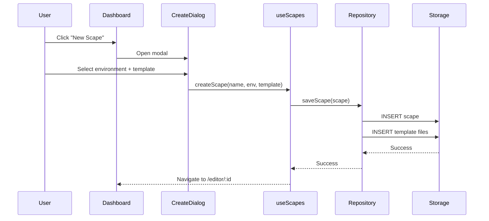
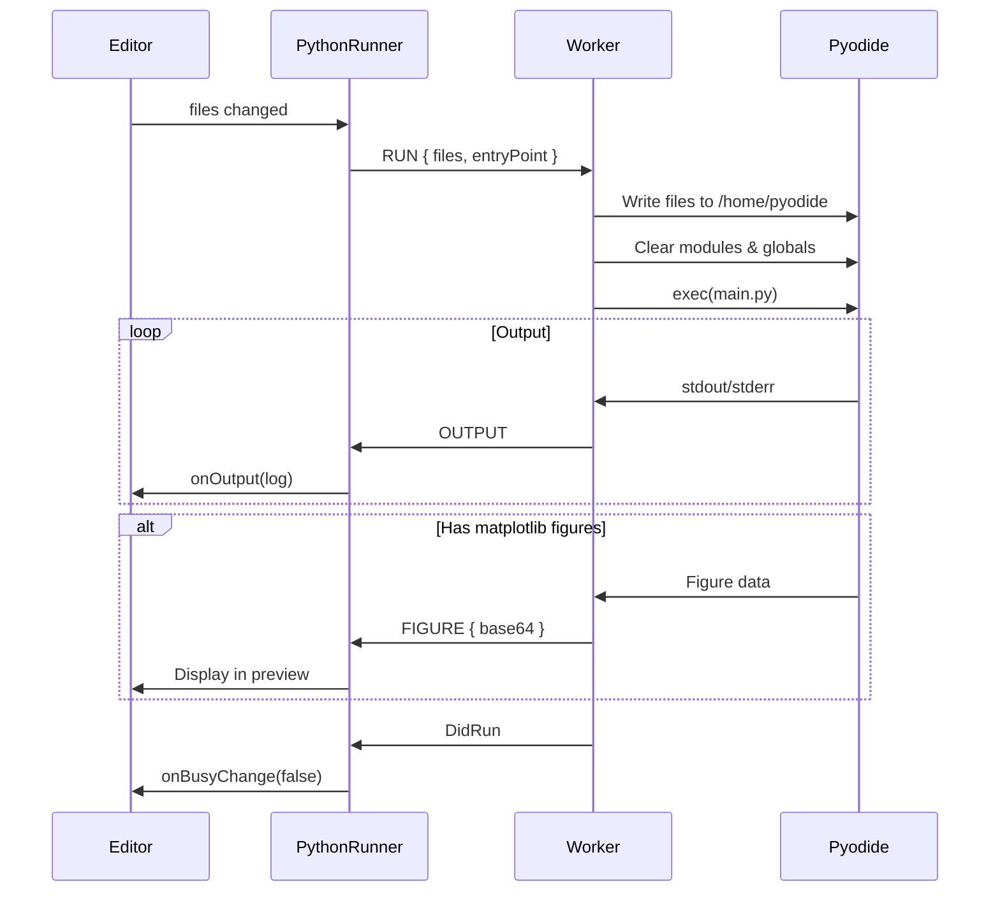

# CodeScapes

> **A Multi-Runtime, Browser-Native IDE for Code Education and Creative Development**

CodeScapes is an open-source, browser-based integrated development environment (IDE) designed to provide instant, zero-installation coding experiences across multiple programming languages and paradigms. Built with modern web technologies, it demonstrates advanced techniques in browser-based code execution, cross-origin isolation, and real-time collaborative architecture.

---

## ⚠️ License & Usage Restrictions

**This software is licensed for NON-COMMERCIAL use only.**

You may:

- Use this software for personal, educational, or research purposes
- Modify and fork the code for non-commercial projects
- Reference this architecture in academic papers (with attribution)

You may NOT:

- Use this software or derivatives in commercial products
- Sell or monetize applications built with this codebase
- Deploy this software as a paid service

For commercial licensing inquiries, please contact:

- 📧 **contact@aaqidmasoodi.com**
- 📧 **collaborate@codescapes.io**

---

## 🤝 Collaboration & Contact

We welcome contributions from the open-source community! Whether you're interested in:

- Adding new runtime environments
- Improving the execution sandbox
- Enhancing the block-based FlowScape editor
- Documentation and research papers

**Get in touch:**

- 📧 **contact@aaqidmasoodi.com**
- 📧 **collaborate@codescapes.io**

---

## Table of Contents

1. [Architecture Overview](#architecture-overview)
2. [Technology Stack](#technology-stack)
3. [Core Subsystems](#core-subsystems)
   - [Runtime Execution Layer](#1-runtime-execution-layer)
   - [Storage Abstraction Layer](#2-storage-abstraction-layer)
   - [Preview Isolation System](#3-preview-isolation-system)
   - [State Management](#4-state-management)
   - [File System Management](#5-file-system-management)
4. [Runtime Implementations](#runtime-implementations)
   - [Python Runtime](#python-runtime-pyodide)
   - [Web Runtime](#web-runtime-html-css-js)
   - [FlowScape Runtime](#flowscape-runtime-visual-programming)
5. [Security Architecture](#security-architecture)
6. [Advanced Subsystems](#advanced-subsystems)
   - [Secure Secrets Vault: The Airlock System](#6-secure-secrets-vault-the-airlock-system)
   - [Python Soft-Reload: Zero-Latency Hot Execution](#7-python-soft-reload-zero-latency-hot-execution)
   - [CS-FS: The Unified Shell Interface](#8-cs-fs-the-unified-shell-interface)
   - [Blob Compiler Architecture](#9-blob-compiler-architecture-secure-code-hydration)
7. [Data Flow Diagrams](#data-flow-diagrams)
8. [Development Setup](#development-setup)
9. [Contributing](#contributing)

---

## Architecture Overview

CodeScapes implements a **layered architecture** designed for extensibility, security, and performance:

```
┌─────────────────────────────────────────────────────────────────────┐
│                         Presentation Layer                          │
│  ┌─────────────┐  ┌──────────────┐  ┌─────────────┐  ┌───────────┐ │
│  │  Dashboard  │  │ ScapeEditor  │  │ FlowEditor  │  │  Header   │ │
│  └─────────────┘  └──────────────┘  └─────────────┘  └───────────┘ │
└─────────────────────────────────────────────────────────────────────┘
                                │
                                ▼
┌─────────────────────────────────────────────────────────────────────┐
│                        Runtime Execution Layer                       │
│  ┌─────────────────┐  ┌─────────────────┐  ┌─────────────────────┐  │
│  │  PythonRunner   │  │   WebRunner     │  │    FlowRunner       │  │
│  │  (Web Worker)   │  │  (iframe + SW)  │  │  (p5.js Engine)     │  │
│  └─────────────────┘  └─────────────────┘  └─────────────────────┘  │
└─────────────────────────────────────────────────────────────────────┘
                                │
                                ▼
┌─────────────────────────────────────────────────────────────────────┐
│                       State Management Layer                         │
│  ┌──────────────────────┐  ┌────────────────────────────────────┐   │
│  │  Zustand Stores      │  │  React Hooks                       │   │
│  │  - flowStore         │  │  - useFileSystem                   │   │
│  │  - (app state)       │  │  - usePreviewBridge                │   │
│  └──────────────────────┘  │  - useScapes, useAuth              │   │
│                            └────────────────────────────────────┘   │
└─────────────────────────────────────────────────────────────────────┘
                                │
                                ▼
┌─────────────────────────────────────────────────────────────────────┐
│                     Storage Abstraction Layer                        │
│  ┌─────────────────────────────────────────────────────────────┐    │
│  │               IScapeRepository Interface                     │    │
│  │  ┌─────────────────────┐    ┌─────────────────────────────┐ │    │
│  │  │  LocalRepository    │    │     CloudRepository         │ │    │
│  │  │  (IndexedDB/Dexie)  │    │     (Supabase)              │ │    │
│  │  └─────────────────────┘    └─────────────────────────────┘ │    │
│  └─────────────────────────────────────────────────────────────┘    │
└─────────────────────────────────────────────────────────────────────┘
```

---

## Technology Stack

| Layer                  | Technology              | Purpose                                       |
| ---------------------- | ----------------------- | --------------------------------------------- |
| **Frontend Framework** | React 18 + TypeScript   | Component architecture & type safety          |
| **Build Tool**         | Vite 7                  | Fast HMR, ESBuild bundling                    |
| **Styling**            | TailwindCSS + shadcn/ui | Utility-first styling, accessible components  |
| **State Management**   | Zustand                 | Lightweight, immutable state stores           |
| **Local Storage**      | Dexie.js (IndexedDB)    | Client-side persistence with live queries     |
| **Cloud Backend**      | Supabase                | Authentication, PostgreSQL, Realtime, Storage |
| **Code Editor**        | Monaco Editor           | VS Code-grade editing experience              |
| **Block Editor**       | Blockly                 | Visual block-based programming                |
| **Python Runtime**     | Pyodide 0.25            | WebAssembly Python interpreter                |
| **Graphics Engine**    | p5.js                   | FlowScape visual runtime                      |
| **Testing**            | Vitest + Playwright     | Unit tests + E2E browser tests                |

---

## Core Subsystems

### 1. Runtime Execution Layer

The runtime layer is architected around a **polymorphic runner interface** that enables multiple language runtimes to coexist:

```typescript
// src/runners/types.ts
interface ScapeRunnerProps {
  files: ScapeFile[]
  dependencies?: string[]
  onOutput?: (log: LogEntry) => void
  onBusyChange?: (isBusy: boolean) => void
  onInputRequest?: (prompt: string) => void
  isLive?: boolean
}

interface ScapeRunnerHandle {
  captureThumbnail(): Promise<string | null>
  restart(): Promise<void>
  installPackage(
    pkg: string,
    onProgress?: (msg: string) => void
  ): Promise<{ success: boolean; error?: string }>
  stop?: () => void
}
```

A **Runner Registry** (`src/runners/registry.ts`) maps environment types to their corresponding runner components:

```typescript
const RUNNER_REGISTRY = {
  web: WebRunner,
  python: PythonRunner,
  "data-science": PythonRunner,
  flowscape: FlowRunner,
  node: WebRunner, // Fallback
}
```

---

### 2. Storage Abstraction Layer

CodeScapes implements the **Repository Pattern** to abstract storage operations, allowing seamless switching between local (IndexedDB) and cloud (Supabase) backends:

```typescript
// src/lib/repositories/types.ts
interface IScapeRepository {
  // Scape (Project) Operations
  getScape(id: string): Promise<Scape | undefined>
  listScapes(userId?: string): Promise<Scape[]>
  saveScape(scape: Scape): Promise<void>
  updateScape(id: string, updates: Partial<Scape>): Promise<void>
  deleteScape(id: string): Promise<void>

  // File Operations
  getFiles(scapeId: string): Promise<ScapeFile[]>
  createFile(file: ScapeFile & { scapeId: string }): Promise<void>
  bulkCreateFiles(files: (ScapeFile & { scapeId: string })[]): Promise<void>
  updateFileContent(id: string, content: string | Blob | ArrayBuffer | Uint8Array): Promise<void>
  updateFileName(id: string, name: string): Promise<void>
  deleteFile(id: string): Promise<void>

  // Bulk Operations
  bulkDeleteFiles(ids: string[]): Promise<void>
  bulkUpdateFiles(updates: { id: string; changes: Partial<ScapeFile> }[]): Promise<void>

  // Realtime Subscriptions (Cloud only)
  subscribeToFiles?(scapeId: string, callback: (event, payload) => void): () => void
}
```

**Implementations:**

| Repository        | Backend              | Features                                                       |
| ----------------- | -------------------- | -------------------------------------------------------------- |
| `LocalRepository` | Dexie.js (IndexedDB) | Offline-first, instant persistence, live queries               |
| `CloudRepository` | Supabase             | User authentication, cross-device sync, realtime collaboration |

The **local database schema** (`src/lib/db.ts`):

```typescript
interface Scape {
  id: string
  name: string
  environment: EnvironmentId // "web" | "python" | "flowscape"
  template: string
  source: "local" | "cloud"
  syncStatus?: "synced" | "dirty" | "offline"
  authorId?: string
  thumbnail?: string
  createdAt: Date
  updatedAt: Date
  dependencies?: string[]
  is_public?: boolean
}

interface File {
  id: string
  scapeId: string
  name: string
  content: string | Blob | ArrayBuffer | Uint8Array
  language: string
}

interface Autosave {
  id: string // scapeId
  data: any // Project JSON (for FlowScape)
  timestamp: number
}
```

---

### 3. Preview Isolation System

A critical security and functionality challenge in browser-based IDEs is **isolating user code execution** from the host application. CodeScapes implements a sophisticated **Cross-Origin Bootloader Architecture**:

```
┌──────────────────────────────────────────────────────────────────┐
│                        Main Application                           │
│  ┌─────────────────────────────────────────────────────────────┐ │
│  │  usePreviewBridge Hook                                       │ │
│  │  - Computes file hash for change detection                  │ │
│  │  - Manages handshake protocol with sandbox                  │ │
│  │  - Hot-swap files via postMessage                           │ │
│  └─────────────────────────────────────────────────────────────┘ │
└──────────────────────────────────────────────────────────────────┘
                            │ postMessage
                            ▼
┌──────────────────────────────────────────────────────────────────┐
│                      Sandbox iframe                               │
│  Origin: localhost:3002 (dev) or /sandbox/* (prod)               │
│  ┌─────────────────────────────────────────────────────────────┐ │
│  │  bootloader.html                                             │ │
│  │  - Receives COMPILE_FILES message                           │ │
│  │  - Injects user HTML/CSS/JS into document                   │ │
│  │  - Executes in isolated context                             │ │
│  └─────────────────────────────────────────────────────────────┘ │
└──────────────────────────────────────────────────────────────────┘
```

**Handshake Protocol:**

1. Parent creates iframe pointing to bootloader URL with cache-busting version key
2. Bootloader sends `SANDBOX_READY` message to parent
3. Parent responds with `COMPILE_FILES` containing all user files
4. Bootloader injects files and executes user code
5. For hot updates: parent detects file hash changes and re-sends `COMPILE_FILES`

**Key Security Properties:**

- User code runs in a separate origin (process isolation on Chrome)
- CSP and sandbox attributes restrict capabilities
- No direct DOM access between parent and child

---

### 4. State Management

CodeScapes uses **Zustand** for global state management, particularly for the FlowScape visual editor:

```typescript
// src/stores/flowStore.ts
interface FlowState {
  project: Project // Full project state (sprites, blocks, costumes)
  activeTargetId: string // Currently selected sprite/stage
  isHydrated: boolean // Whether state is loaded from storage

  // Actions
  hydrate: (scapeId: string, initialProject?: Project) => Promise<void>
  setActiveTarget: (id: string) => void
  addSprite: (asset?: { name: string; color?: string }) => void
  addBackdrop: (asset: { name: string; color: string }) => void
  deleteTarget: (targetId: string) => void
  updateTargetBlocks: (targetId: string, blocks: any) => void
  updateTargetCode: (targetId: string, code: string) => void
  syncTargets: (updates: Partial<Target>[]) => void
}
```

**Persistence Strategy:**

The store implements **automatic autosave** via Zustand subscriptions:

```typescript
export const initAutosave = (scapeId: string) => {
  return useFlowStore.subscribe((state) => {
    if (!state.isHydrated) return // Don't overwrite real data with empty state

    db.autosaves.put({
      id: scapeId,
      data: state.project,
      timestamp: Date.now(),
    })
  })
}
```

This ensures that every state change is immediately persisted to IndexedDB, providing crash recovery and session restoration.

---

### 5. File System Management

The `useFileSystem` hook (`src/hooks/useFileSystem.ts`) provides a unified interface for file operations across local and cloud storage:

```typescript
function useFileSystem(scapeId: string, source: "local" | "cloud" = "local") {
  // Returns:
  return {
    files: ScapeFile[],           // Current file list
    isInitialized: boolean,       // Whether files are loaded

    // CRUD Operations
    createFile: (name, language, content) => Promise<void>,
    updateFile: (name, content) => Promise<void>,
    renameFile: (oldName, newName) => Promise<void>,
    deleteFile: (name) => Promise<void>,
    moveFile: (oldPath, newPath) => Promise<void>,

    // Bulk Operations
    createFolder: (path) => Promise<void>,
    deleteFolder: (path) => Promise<void>,
    moveFolder: (oldPath, newPath) => Promise<void>,
  }
}
```

**Key Features:**

- **Optimistic Updates**: UI updates immediately while async operations complete
- **Live Queries** (Local): Dexie's `useLiveQuery` for reactive data binding
- **Realtime Subscriptions** (Cloud): Supabase Realtime for collaborative editing
- **Smart Merge**: When files change externally, intelligent conflict resolution

---

## Runtime Implementations

### Python Runtime (Pyodide)

The Python runtime (`src/runners/python/`) uses **Pyodide** (Python compiled to WebAssembly) running in a dedicated **Web Worker** for isolation:

```
┌────────────────────────────────────────────────────────────────┐
│                    Main Thread (React)                          │
│  ┌─────────────────────────────────────────────────────────┐   │
│  │  PythonRunner.tsx                                        │   │
│  │  - Manages worker lifecycle                              │   │
│  │  - Sends RUN/INSTALL messages                            │   │
│  │  - Receives OUTPUT/ERROR/FIGURE responses                │   │
│  └─────────────────────────────────────────────────────────┘   │
└────────────────────────────────────────────────────────────────┘
                         │ postMessage
                         ▼
┌────────────────────────────────────────────────────────────────┐
│                    Web Worker Thread                            │
│  ┌─────────────────────────────────────────────────────────┐   │
│  │  worker.ts                                               │   │
│  │  ┌─────────────────────────────────────────────────┐    │   │
│  │  │  Pyodide (WASM)                                  │    │   │
│  │  │  - Python interpreter                            │    │   │
│  │  │  - Virtual file system (/home/pyodide)          │    │   │
│  │  │  - micropip for package installation            │    │   │
│  │  └─────────────────────────────────────────────────┘    │   │
│  │                                                          │   │
│  │  Features:                                               │   │
│  │  - stdout/stderr capture and streaming                  │   │
│  │  - matplotlib figure capture (base64 PNG)              │   │
│  │  - Python input() support via Service Worker           │   │
│  │  - Module hot-reload with sys.modules cleanup          │   │
│  └─────────────────────────────────────────────────────────┘   │
└────────────────────────────────────────────────────────────────┘
```

**Message Protocol:**

| Message Type    | Direction     | Purpose                                  |
| --------------- | ------------- | ---------------------------------------- |
| `INIT`          | Main → Worker | Initialize Pyodide, install dependencies |
| `RUN`           | Main → Worker | Execute Python code with file system     |
| `INSTALL`       | Main → Worker | Install packages via micropip            |
| `OUTPUT`        | Worker → Main | stdout/stderr text                       |
| `ERROR`         | Worker → Main | Python exception details                 |
| `FIGURE`        | Worker → Main | Base64 matplotlib figure                 |
| `INPUT_REQUEST` | Worker → Main | Python `input()` prompt                  |
| `FS_UPDATE`     | Worker → Main | File system changes from Python          |

**Hot-Reload Implementation:**

On each `RUN` message, the worker performs aggressive module cleanup:

```python
# 0. Reset Environment
for name in list(globals().keys()):
    if name not in ['__name__', '__doc__', '__package__', ...]:
        del globals()[name]

# 0.1 Aggressive Module Cleanup
import sys
to_delete = []
for name, module in list(sys.modules.items()):
    if hasattr(module, '__file__') and module.__file__:
        if not module.__file__.startswith('/lib'):
            to_delete.append(name)

for name in to_delete:
    del sys.modules[name]

importlib.invalidate_caches()
```

This ensures that user-defined modules are reloaded from disk on each run, providing true hot-reload semantics.

---

### Web Runtime (HTML/CSS/JS)

The Web runtime (`src/runners/web/WebRunner.tsx`) uses the **Cross-Origin Bootloader** system described in the [Preview Isolation System](#3-preview-isolation-system) section.

**Key Characteristics:**

- **Full Reload on Change**: Unlike traditional HMR, CodeScapes forces full iframe reloads for reliability
- **Import Map Support**: ES Modules with import maps (e.g., Three.js, p5.js)
- **Secret Injection**: Environment variables are injected via the bootloader protocol
- **Thumbnail Capture**: Uses html2canvas for project thumbnails

---

### FlowScape Runtime (Visual Programming)

FlowScape (`src/runners/flow/`) is a **Scratch-inspired visual programming environment** built with:

- **Blockly**: Google's visual block programming library
- **p5.js**: The graphics engine for real-time rendering
- **Custom Compiler**: Converts blocks to executable JavaScript

```
┌────────────────────────────────────────────────────────────────┐
│                    FlowEditor.tsx                               │
│  ┌─────────────────────────────────────────────────────────┐   │
│  │  BlockEditor (Blockly)                                   │   │
│  │  - Sprite selection panel                                │   │
│  │  - Block palette & workspace                             │   │
│  │  - Real-time code generation                             │   │
│  └─────────────────────────────────────────────────────────┘   │
│                         │ Block Changes                         │
│                         ▼                                       │
│  ┌─────────────────────────────────────────────────────────┐   │
│  │  FlowRunner.tsx                                          │   │
│  │  - Compiles project.json to engine bundle               │   │
│  │  - Injects p5.js + custom engine.js                     │   │
│  │  - Bi-directional state sync via postMessage            │   │
│  └─────────────────────────────────────────────────────────┘   │
│                         │                                       │
│                         ▼                                       │
│  ┌─────────────────────────────────────────────────────────┐   │
│  │  iframe (p5.js Runtime)                                  │   │
│  │  ┌─────────────────────────────────────────────────┐    │   │
│  │  │  Runtime Class                                   │    │   │
│  │  │  - Manages Target (Sprite) instances             │    │   │
│  │  │  - Scheduler for concurrent script execution     │    │   │
│  │  │  - Collision detection, movement, costumes       │    │   │
│  │  └─────────────────────────────────────────────────┘    │   │
│  │  ┌─────────────────────────────────────────────────┐    │   │
│  │  │  Target Class                                    │    │   │
│  │  │  - Position, direction, size, visibility        │    │   │
│  │  │  - Costume management                            │    │   │
│  │  │  - User code (from blocks)                       │    │   │
│  │  └─────────────────────────────────────────────────┘    │   │
│  │  ┌─────────────────────────────────────────────────┐    │   │
│  │  │  Scheduler Class                                 │    │   │
│  │  │  - Cooperative multitasking via generators       │    │   │
│  │  │  - waitSeconds() via yield                       │    │   │
│  │  │  - Thread management per target                  │    │   │
│  │  └─────────────────────────────────────────────────┘    │   │
│  └─────────────────────────────────────────────────────────┘   │
└────────────────────────────────────────────────────────────────┘
```

**State Synchronization:**

FlowScape maintains bi-directional sync between the Zustand store and the iframe runtime:

1. **Store → Runtime**: When blocks change, the compiler generates new code and sends it via `FLOW:HOT_UPDATE`
2. **Runtime → Store**: The runtime broadcasts sprite positions every ~100ms via `FlowScape:StateUpdate`

This enables:

- Live editing of block code with instant preview
- Dragging sprites in the preview updates the editor state
- Runtime state preservation during code hot-swaps

---

## Security Architecture

### Threat Model

CodeScapes executes **arbitrary user code** in the browser. The security model addresses:

1. **DOM Isolation**: User code cannot access parent application DOM
2. **Origin Isolation**: Sandboxed iframes run on separate origins (process isolation)
3. **Network Restrictions**: CSP limits outbound network requests
4. **Storage Isolation**: User projects cannot access other users' data

### Implementation

| Mechanism                     | Purpose                             |
| ----------------------------- | ----------------------------------- |
| Cross-Origin iframes          | Process-level isolation on Chromium |
| `sandbox` attribute           | Restricts iframe capabilities       |
| Service Worker interception   | Controls resource loading           |
| Row-Level Security (Supabase) | Database access control             |
| Web Worker isolation          | Python runs in isolated thread      |

---

## Advanced Subsystems

This section provides research-level detail on sophisticated subsystems that solve unique challenges in browser-based code execution.

---

### 6. Secure Secrets Vault: The Airlock System

**The Problem:**

Browser-based code execution environments face a fundamental security challenge: how do you allow user code to access sensitive credentials (API keys, tokens, database URLs) without exposing them to:

1. Other users' projects
2. Browser's localStorage (easily inspectable)
3. Network requests visible in DevTools
4. The source code itself (git-committed secrets)

Traditional solutions like `.env` files don't work in browser environments—there's no filesystem, and any injected variables would be visible in the bundled JavaScript.

**The Airlock Architecture:**

CodeScapes implements a **multi-stage airlock** that ensures secrets are:

- Stored encrypted server-side (Supabase)
- Fetched only for the owning user
- Injected at runtime into isolated execution contexts
- Never persisted in client-side storage

```
┌─────────────────────────────────────────────────────────────────────────┐
│                         SECRETS FLOW                                     │
├─────────────────────────────────────────────────────────────────────────┤
│                                                                          │
│   ┌──────────────┐    ┌──────────────┐    ┌────────────────────────┐   │
│   │  User Input  │───▶│ SecretsPanel │───▶│  Supabase (encrypted)  │   │
│   │  (UI Form)   │    │  (React)     │    │  secrets table         │   │
│   └──────────────┘    └──────────────┘    └────────────────────────┘   │
│                                                    │                     │
│                              ┌─────────────────────┘                     │
│                              ▼                                           │
│   ┌──────────────────────────────────────────────────────────────────┐  │
│   │                    AIRLOCK STAGE 1: Fetch                         │  │
│   │   secretsService.getSecrets(scapeId) → Secret[]                  │  │
│   │   - Fetches only for authenticated user                          │  │
│   │   - Row-Level Security ensures ownership                         │  │
│   └──────────────────────────────────────────────────────────────────┘  │
│                              │                                           │
│                              ▼                                           │
│   ┌──────────────────────────────────────────────────────────────────┐  │
│   │                    AIRLOCK STAGE 2: Injection                     │  │
│   │   Runner receives envVars in memory only                         │  │
│   │   - Python: os.environ.update(_env_data)                         │  │
│   │   - Web: window.process.env = {...}                              │  │
│   └──────────────────────────────────────────────────────────────────┘  │
│                              │                                           │
│                              ▼                                           │
│   ┌──────────────────────────────────────────────────────────────────┐  │
│   │                    AIRLOCK STAGE 3: Destruction                   │  │
│   │   - Web Worker terminates: envVars garbage collected             │  │
│   │   - iframe reloads: process.env reset                            │  │
│   │   - Never written to disk or localStorage                        │  │
│   └──────────────────────────────────────────────────────────────────┘  │
│                                                                          │
└─────────────────────────────────────────────────────────────────────────┘
```

**Implementation Details:**

```typescript
// src/services/secrets.ts
export const secretsService = {
  async getSecrets(scapeId: string) {
    const { data, error } = await supabase
      .from("secrets")
      .select("*")
      .eq("scape_id", scapeId) // RLS enforces ownership
      .order("key")
    return data as Secret[]
  },

  async upsertSecret(scapeId: string, key: string, value: string) {
    // Unique constraint on (scape_id, key) enables upsert
    const { data, error } = await supabase
      .from("secrets")
      .upsert({ scape_id: scapeId, key, value }, { onConflict: "scape_id,key" })
    return data as Secret
  },
}
```

**Secrets Injection (Python Runtime):**

```typescript
// worker.ts - Injecting secrets into Python's os.environ
if (payload.env) {
  const envJson = JSON.stringify(payload.env)
  await py.runPythonAsync(`
    import os
    import json
    _env_data = json.loads('''${envJson}''')
    os.environ.update(_env_data)
  `)
}
```

**Secrets Injection (Web Runtime - Service Worker):**

```javascript
// public/sandbox/sw.js - Injecting into window.process.env
const injectionScript = `<script>
  (function() {
    var env = ${JSON.stringify(envSafe)};
    window.process = window.process || {};
    window.process.env = env;
  })();
</script>`

// Inject into HTML before execution
if (ext === ".html" && typeof blob === "string") {
  blob = blob.replace(/<head[^>]*>/i, (match) => `${match}${injectionScript}`)
}
```

**User Interface (`.env` Paste Support):**

The SecretsPanel supports bulk import from `.env` file format:

```typescript
// src/components/secrets/SecretsPanel.tsx
const handlePasteEnv = (text: string) => {
  const lines = text.split("\n")
  for (const line of lines) {
    const trimmed = line.trim()
    if (!trimmed || trimmed.startsWith("#")) continue

    const eqIndex = trimmed.indexOf("=")
    if (eqIndex > 0) {
      const key = trimmed.slice(0, eqIndex).trim()
      let value = trimmed.slice(eqIndex + 1).trim()
      // Remove surrounding quotes
      if (
        (value.startsWith('"') && value.endsWith('"')) ||
        (value.startsWith("'") && value.endsWith("'"))
      ) {
        value = value.slice(1, -1)
      }
      secretsService.upsertSecret(scapeId, key, value)
    }
  }
}
```

---

### 7. Python Soft-Reload: Zero-Latency Hot Execution

**The Problem:**

Traditional approaches to "re-running" Python code in WebAssembly involve:

1. Terminating the Web Worker
2. Re-instantiating Pyodide (~2-5 seconds cold start)
3. Re-installing packages (~10-30 seconds for heavy packages like NumPy)

This creates unacceptable latency for interactive coding experiences. Users expect sub-second feedback when modifying code.

**The Soft-Reload Solution:**

CodeScapes implements a **soft-reload** mechanism that keeps the Pyodide instance alive while achieving true hot-reload semantics through aggressive environment cleanup:

```
┌─────────────────────────────────────────────────────────────────────┐
│                    SOFT-RELOAD EXECUTION FLOW                        │
├─────────────────────────────────────────────────────────────────────┤
│                                                                      │
│   File Change Detected                                               │
│          │                                                           │
│          ▼                                                           │
│   ┌─────────────────────────────────────────────────────────────┐   │
│   │  PHASE 0: Environment Reset (in existing worker)            │   │
│   │  ├─ Clear global namespace (preserve builtins)              │   │
│   │  ├─ Delete user modules from sys.modules                    │   │
│   │  ├─ Invalidate import caches                                │   │
│   │  ├─ Reset logging handlers                                  │   │
│   │  ├─ Close matplotlib figures                                │   │
│   │  └─ Reset sys.argv                                          │   │
│   └─────────────────────────────────────────────────────────────┘   │
│          │                                                           │
│          ▼                                                           │
│   ┌─────────────────────────────────────────────────────────────┐   │
│   │  PHASE 1: Virtual FS Sync                                    │   │
│   │  ├─ Remove all files in working directory                   │   │
│   │  └─ Write new file contents from editor                     │   │
│   └─────────────────────────────────────────────────────────────┘   │
│          │                                                           │
│          ▼                                                           │
│   ┌─────────────────────────────────────────────────────────────┐   │
│   │  PHASE 2: Execute (same Pyodide instance)                    │   │
│   │  └─ exec(compile(code, 'main.py', 'exec'))                   │   │
│   └─────────────────────────────────────────────────────────────┘   │
│          │                                                           │
│          ▼                                                           │
│   Result: ~50-200ms total (vs 5-30s for worker restart)             │
│                                                                      │
└─────────────────────────────────────────────────────────────────────┘
```

**Critical Implementation: Module Cleanup**

The key to hot-reload correctness is ensuring that **user-defined modules are evicted from `sys.modules`**. Without this, Python's import cache would serve stale code:

```python
# worker.ts - Executed before each RUN
# 0.1 Aggressive Module Cleanup
import sys
import os
import importlib

to_delete = []
cwd = os.getcwd()

for name, module in list(sys.modules.items()):
    if hasattr(module, '__file__') and module.__file__:
        fpath = module.__file__

        # User Module Detection:
        # Pyodide places stdlib in /lib
        # User code is in /home/pyodide or working directory
        if not fpath.startswith('/lib'):
           to_delete.append(name)

for name in to_delete:
    del sys.modules[name]

importlib.invalidate_caches()
```

**State Hardening:**

Beyond modules, persistent state can leak between runs. CodeScapes resets:

```python
# Reset Logging (prevents duplicate handlers)
import logging
logging.getLogger().handlers.clear()

# Reset Matplotlib (prevents figure accumulation)
import matplotlib.pyplot as plt
plt.close('all')

# Reset argv (scripts might mutate it)
sys.argv = ['']
```

**Virtual File System Synchronization:**

```python
# Clean up virtual FS before writing new files
for item in os.listdir('.'):
    if item in ['.', '..']: continue
    try:
        if os.path.isfile(item) or os.path.islink(item):
            os.unlink(item)
        elif os.path.isdir(item):
            shutil.rmtree(item)
    except:
        pass
```

**Performance Characteristics:**

| Operation         | Cold Start | Soft-Reload  |
| ----------------- | ---------- | ------------ |
| Pyodide Init      | 2-5s       | 0ms (reused) |
| micropip packages | 5-30s      | 0ms (cached) |
| Environment Reset | N/A        | ~20ms        |
| File Sync         | N/A        | ~10ms        |
| Execute           | ~50ms      | ~50ms        |
| **Total**         | **7-35s**  | **~80ms**    |

---

### 8. CS-FS: The Unified Shell Interface

**The Problem:**

Browser-based IDEs typically lack terminal/shell interfaces, limiting productivity for developers accustomed to command-line workflows. While the browser has no true filesystem, CodeScapes maintains a **virtual file tree** that users expect to manipulate via familiar commands.

**The CS-FS (CodeScape File System) Shell:**

CodeScapes implements a **POSIX-like shell** that bridges the gap between terminal commands and the virtual file system:

```
┌─────────────────────────────────────────────────────────────────────┐
│                      CS-FS SHELL ARCHITECTURE                        │
├─────────────────────────────────────────────────────────────────────┤
│                                                                      │
│   User Input: "echo 'Hello' > greeting.txt"                         │
│          │                                                           │
│          ▼                                                           │
│   ┌─────────────────────────────────────────────────────────────┐   │
│   │  PARSER (lib/shell/parser.ts)                                │   │
│   │  ├─ Tokenize (respecting quotes)                            │   │
│   │  ├─ Parse redirects (>, >>)                                 │   │
│   │  └─ Return: { command, args, redirect }                     │   │
│   └─────────────────────────────────────────────────────────────┘   │
│          │                                                           │
│          ▼                                                           │
│   ┌─────────────────────────────────────────────────────────────┐   │
│   │  COMMAND REGISTRY (hooks/useShell.ts)                        │   │
│   │  ├─ echo, pwd, ls, cat, touch, rm, mkdir, pip               │   │
│   │  └─ Execute with ShellContext                                │   │
│   └─────────────────────────────────────────────────────────────┘   │
│          │                                                           │
│          ▼                                                           │
│   ┌─────────────────────────────────────────────────────────────┐   │
│   │  SHELL CONTEXT (Kernel Interface)                            │   │
│   │  ├─ cwd: string (virtual working directory)                 │   │
│   │  ├─ files: ScapeFile[] (current file state)                 │   │
│   │  ├─ createFile() → useFileSystem.createFile                 │   │
│   │  ├─ updateFile() → useFileSystem.updateFile                 │   │
│   │  ├─ deleteFile() → useFileSystem.deleteFile                 │   │
│   │  └─ execCommand() → Runner commands (pip install)           │   │
│   └─────────────────────────────────────────────────────────────┘   │
│          │                                                           │
│          ▼                                                           │
│   ┌─────────────────────────────────────────────────────────────┐   │
│   │  STORAGE LAYER (Repository)                                  │   │
│   │  ├─ LocalRepository → IndexedDB                             │   │
│   │  └─ CloudRepository → Supabase                              │   │
│   └─────────────────────────────────────────────────────────────┘   │
│                                                                      │
└─────────────────────────────────────────────────────────────────────┘
```

**Command Parser (Quote-Aware Tokenization):**

```typescript
// lib/shell/parser.ts
export function parseCommand(input: string): ParsedCommand | null {
  const tokens: string[] = []
  let current = ""
  let inQuote: '"' | "'" | null = null

  for (const char of input) {
    if (inQuote) {
      if (char === inQuote) {
        inQuote = null
      } else {
        current += char
      }
    } else {
      if (char === '"' || char === "'") {
        inQuote = char
      } else if (char === " ") {
        if (current) {
          tokens.push(current)
          current = ""
        }
      } else {
        current += char
      }
    }
  }

  // Parse redirects: > (write) and >> (append)
  let redirect: ParsedCommand["redirect"] | undefined
  for (let i = 0; i < tokens.length; i++) {
    if (tokens[i] === ">" || tokens[i] === ">>") {
      redirect = {
        type: tokens[i] === ">" ? "write" : "append",
        target: tokens[i + 1],
      }
    }
  }

  return { command: tokens[0], args: tokens.slice(1), redirect }
}
```

**Implemented Commands:**

| Command | Syntax              | Description             |
| ------- | ------------------- | ----------------------- |
| `echo`  | `echo "text"`       | Print text to stdout    |
| `pwd`   | `pwd`               | Print working directory |
| `ls`    | `ls [path]`         | List files in directory |
| `cat`   | `cat <file>`        | Display file contents   |
| `touch` | `touch <file>`      | Create empty file       |
| `rm`    | `rm <file>`         | Delete file             |
| `mkdir` | `mkdir <dir>`       | Create directory        |
| `pip`   | `pip install <pkg>` | Install Python package  |

**File Redirection:**

The shell supports POSIX-style output redirection:

```typescript
// hooks/useShell.ts - Redirect handling
if (parsed.redirect) {
  const content = output.content
  const target = parsed.redirect.target

  if (parsed.redirect.type === "write") {
    // > overwrites file
    const exists = fs.files.find((f) => f.name === target)
    if (exists) {
      await fs.updateFile(target, content)
    } else {
      await fs.createFile(target, "plaintext", content)
    }
  } else if (parsed.redirect.type === "append") {
    // >> appends to file
    const exists = fs.files.find((f) => f.name === target)
    if (exists && typeof exists.content === "string") {
      await fs.updateFile(target, exists.content + "\n" + content)
    } else {
      await fs.createFile(target, "plaintext", content)
    }
  }
}
```

**Runner Command Bridge (pip):**

The shell can invoke runner-specific commands through the `execCommand` bridge:

```typescript
// pip install command
pip: async (args, ctx) => {
  if (!ctx.execCommand) {
    return { type: "error", content: "pip: environment does not support package management" }
  }

  const subCmd = args[0] // "install" or "uninstall"
  const packages = args.slice(1).filter((a) => !a.startsWith("-"))

  if (subCmd === "install") {
    ctx.log({ type: "stdout", content: `Collecting ${packages.join(", ")}...` })

    const result = await ctx.execCommand(
      "pip-install",
      JSON.stringify({
        packages,
        options: { noDeps: args.includes("--no-deps") },
      }),
      (msg) => ctx.log({ type: "stdout", content: msg })
    )

    if (result.success) {
      return { type: "stdout", content: `Successfully installed ${packages.join(", ")}` }
    }
  }
}
```

---

### 9. Blob Compiler Architecture: Secure Code Hydration

**The Problem:**

When executing user-authored HTML/CSS/JS in a browser sandbox, several challenges emerge:

1. **File Resolution**: User code references files like `./style.css` that don't exist on any server
2. **Secret Injection**: Environment variables must be available as `process.env.KEY`
3. **Isolation**: User code must not be able to access the parent application
4. **Hot Updates**: File changes should reflect instantly without full page reloads

**The Blob Compiler Solution:**

CodeScapes implements a **Blob Compiler** architecture using Service Workers to create a virtual filesystem that the iframe can fetch from:

```
┌─────────────────────────────────────────────────────────────────────────┐
│                    BLOB COMPILER ARCHITECTURE                            │
├─────────────────────────────────────────────────────────────────────────┤
│                                                                          │
│   React Application (Main Origin)                                        │
│   ┌─────────────────────────────────────────────────────────────────┐   │
│   │  WebRunner.tsx                                                   │   │
│   │  └─ usePreviewBridge(files, scapeId, iframeRef, env)            │   │
│   │      ├─ Compute file hash for change detection                  │   │
│   │      └─ Send COMPILE_FILES via postMessage                      │   │
│   └─────────────────────────────────────────────────────────────────┘   │
│          │                                                               │
│          │ postMessage({ type: "COMPILE_FILES", payload: { files } })   │
│          ▼                                                               │
│   ┌─────────────────────────────────────────────────────────────────┐   │
│   │  Sandbox Origin (/sandbox/bootloader.html)                       │   │
│   │  ┌───────────────────────────────────────────────────────────┐  │   │
│   │  │  bootloader.js                                             │  │   │
│   │  │  ├─ Register sandbox/sw.js Service Worker                 │  │   │
│   │  │  ├─ Wait for SW to be controlling                         │  │   │
│   │  │  ├─ Send SANDBOX_READY to parent                          │  │   │
│   │  │  └─ Forward COMPILE_FILES to SW via MessageChannel        │  │   │
│   │  └───────────────────────────────────────────────────────────┘  │   │
│   │          │                                                       │   │
│   │          ▼                                                       │   │
│   │  ┌───────────────────────────────────────────────────────────┐  │   │
│   │  │  sandbox/sw.js (Service Worker)                            │  │   │
│   │  │  ├─ HYDRATE message handler:                              │  │   │
│   │  │  │   ├─ Create in-memory Map<filename, Blob>              │  │   │
│   │  │  │   ├─ Inject secrets preamble into HTML files          │  │   │
│   │  │  │   ├─ Fetch remote assets (Supabase Storage)           │  │   │
│   │  │  │   └─ Send ACK when complete                            │  │   │
│   │  │  │                                                         │  │   │
│   │  │  └─ fetch event handler:                                  │  │   │
│   │  │      ├─ Intercept /sandbox/run/<scapeId>/<path>          │  │   │
│   │  │      ├─ Serve file from in-memory Map                     │  │   │
│   │  │      └─ Return 404 if not found                           │  │   │
│   │  └───────────────────────────────────────────────────────────┘  │   │
│   │          │                                                       │   │
│   │          ▼                                                       │   │
│   │  ┌───────────────────────────────────────────────────────────┐  │   │
│   │  │  User Code Executes at /sandbox/run/:scapeId/index.html   │  │   │
│   │  │  ├─ Fetch requests intercepted by SW                     │  │   │
│   │  │  ├─ process.env available via injected preamble          │  │   │
│   │  │  └─ Isolated from parent application                      │  │   │
│   │  └───────────────────────────────────────────────────────────┘  │   │
│   └─────────────────────────────────────────────────────────────────┘   │
│                                                                          │
└─────────────────────────────────────────────────────────────────────────┘
```

**Service Worker Hydration:**

```javascript
// public/sandbox/sw.js
self.addEventListener("message", async (event) => {
  if (event.data.type === "HYDRATE") {
    const { scapeId, files, env } = event.data.payload

    // Prepare secrets injection script
    const injectionScript = `<script>
      (function() {
        var env = ${JSON.stringify(env || {})};
        window.process = window.process || {};
        window.process.env = env;
      })();
    </script>`

    const scapeFs = new Map()

    for (const file of files) {
      let blob = file.content
      const ext = file.name.substring(file.name.lastIndexOf("."))
      let type = MIME_TYPES[ext] || "text/plain"

      // Inject secrets into HTML files
      if (ext === ".html" && typeof blob === "string") {
        blob = blob.replace(/<head[^>]*>/i, (match) => `${match}${injectionScript}`)
      }

      // Handle remote assets (Supabase Storage URLs)
      if (typeof blob === "string" && blob.startsWith("http")) {
        const res = await fetch(blob, { mode: "cors" })
        blob = await res.blob()
      }

      // Convert to Blob for streaming response
      if (typeof blob === "string") {
        blob = new Blob([blob], { type })
      }

      scapeFs.set(file.name, blob)
    }

    fileSystem.set(scapeId, scapeFs)
    event.ports[0].postMessage({ type: "ACK" })
  }
})
```

**Fetch Interception:**

```javascript
// public/sandbox/sw.js
self.addEventListener("fetch", (event) => {
  const url = new URL(event.request.url)

  // Intercept: /sandbox/run/<scapeId>/<path>
  if (url.pathname.includes("/run/")) {
    const parts = url.pathname.split("/run/")[1].split("/")
    const scapeId = parts[0]
    const filePath = parts.slice(1).join("/") || "index.html"

    const scapeFs = fileSystem.get(scapeId)
    if (!scapeFs) {
      return event.respondWith(new Response("Sandbox not hydrated", { status: 404 }))
    }

    const file = scapeFs.get(filePath)
    if (file) {
      return event.respondWith(
        new Response(file, {
          status: 200,
          headers: {
            "Content-Type": file.type,
            "Cache-Control": "no-store", // Prevent stale code
            "Cross-Origin-Resource-Policy": "cross-origin",
          },
        })
      )
    }

    return event.respondWith(new Response("File not found", { status: 404 }))
  }
})
```

**Bridge Protocol (usePreviewBridge):**

```typescript
// hooks/usePreviewBridge.ts
export function usePreviewBridge(
  files: ScapeFile[],
  scapeId: string,
  iframeRef?: React.RefObject<HTMLIFrameElement>,
  env?: Record<string, string>,
  versionKey?: number
): PreviewBridge {
  // Compute stable file hash for change detection
  const filesHash = useMemo(() => {
    return files
      .map((f) => `${f.name}:${getContentSize(f.content)}:${getContentPreview(f.content)}`)
      .sort()
      .join("|")
  }, [files])

  // Handshake listener
  useLayoutEffect(() => {
    const handleMessage = (event: MessageEvent) => {
      if (event.data.type === "SANDBOX_READY") {
        // Sandbox is ready, send files
        iframeRef.current?.contentWindow?.postMessage(
          {
            type: "COMPILE_FILES",
            payload: { scapeId, files, env },
          },
          bootloaderOrigin
        )
        setBridgeState((prev) => ({ ...prev, ready: true }))
      }
    }

    window.addEventListener("message", handleMessage)
    return () => window.removeEventListener("message", handleMessage)
  }, [scapeId, files, env])

  return bridgeState
}
```

---

## Data Flow Diagrams

### Project Creation Flow



### Python Execution Flow



---

## Development Setup

### Prerequisites

- Node.js 18+
- pnpm (recommended) or npm

### Installation

```bash
# Clone the repository
git clone https://github.com/aaqidmasoodi/CodeScapes.git
cd CodeScapes

# Install dependencies
pnpm install

# Start development server
pnpm dev
```

### Environment Variables

Create a `.env.local` file:

```env
VITE_SUPABASE_URL=your_supabase_url
VITE_SUPABASE_ANON_KEY=your_supabase_anon_key
```

### Running Tests

```bash
# Unit tests
pnpm test

# E2E tests
pnpm test:e2e

# Type checking
pnpm typecheck
```

---

## Contributing

We welcome contributions! Please see our [CONTRIBUTING.md](CONTRIBUTING.md) for guidelines.

### Areas of Interest

- **New Runtimes**: Rust (via WASM), Java (via CheerpJ), or other languages
- **Collaboration Features**: Real-time multiplayer editing
- **Mobile Support**: Touch-friendly block editor
- **Accessibility**: Screen reader support for visual programming
- **Documentation**: Tutorials, API docs, architecture deep-dives

---

## Acknowledgments

- [Pyodide](https://pyodide.org/) - Python in the browser via WebAssembly
- [Blockly](https://developers.google.com/blockly) - Visual block programming
- [p5.js](https://p5js.org/) - Creative coding graphics library
- [Supabase](https://supabase.com/) - Open-source Firebase alternative
- [shadcn/ui](https://ui.shadcn.com/) - Beautiful accessible components

---

**© 2024 Aaqid Masoodi. All rights reserved. Non-commercial use only.**
